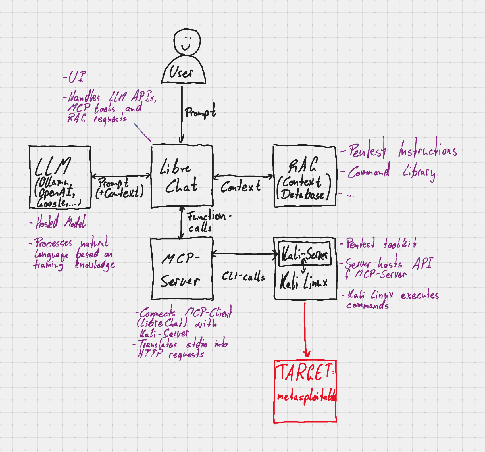

# The LLM Kali Engine
**Natural-Language–Driven Kali Linux Execution using Model Context Protocol**

---

## Overview

**The LLM Kali Engine via MCP** is an AI-driven execution engine that enables **Large Language Models (LLMs) and autonomous agents to control a live Kali Linux environment using high-level natural language instructions**.

Instead of manually selecting tools, flags, and execution order, users can describe **what they want to achieve**, and the LLM automatically:
- Understands intent
- Builds an execution checklist
- Selects appropriate Kali Linux tools
- Chooses correct flags and wordlists
- Executes commands
- Analyzes output and decides next steps

This engine bridges **human intent → LLM reasoning → real-world offensive security execution** using the **Model Context Protocol (MCP)**.

## Video

[Demo](Video.mp4)
Yt- https://www.youtube.com/watch?v=A5X0Ygb8QHs

### Workflow Explained

  


1. User or Claude provides a high-level natural language goal  
2. LLM converts the goal into a checklist and execution plan  
3. LLM invokes `run_command(cmd)` via MCP  
4. MCP server forwards the command to the SSH layer  
5. Command executes on an isolated Kali Linux VM  
6. `stdout` / `stderr` is returned  
7. LLM analyzes output and decides next step  
8. Loop continues until the goal is achieved


## Why This Engine Is Powerful

Traditional security tooling requires deep expertise in tool selection, flag tuning, execution order, and output interpretation.

With this engine, even **imprecise or poorly worded prompts** work effectively.

### Example Prompt

Find credentials for this website using brute force

### What the LLM Automatically Handles

- Determines the attack surface (web login, SSH, FTP, etc.)
- Generates a checklist:
  - Reconnaissance
  - Service discovery
  - Feasibility analysis
  - Credential attack strategy
- Selects tools (nmap, hydra, ffuf, etc.)
- Chooses correct flags and wordlists
- Executes commands on Kali Linux
- Evaluates results and adapts execution


## Project Structure
```
kali-mcp/
├── server.py
├── ssh_client.py
├── config.py
├── requirements.txt
└── README.md
```
---

## Tech Stack

- Python 3.10+
- Model Context Protocol (MCP)
- FastMCP
- Paramiko (SSH)
- pexpect


## Required Configuration

>This engine executes raw shell commands on the connected system.
>LLM-generated commands like rm -rf / will run as-is.

- Use ONLY an isolated system
- Dedicated Kali Linux / Linux VM
- Never your host OS
- Never production systems
- Treat the machine as disposable (snapshots recommended)

### config.py
```
KALI_HOST = "CHANGE_ME"
KALI_USER = "kali"
KALI_PASSWORD = "CHANGE_ME"
PROMPT = r"[#$]"
MAX_OUTPUT = 8000
```
### ssh_client.py
```
self.host = "CHANGE_ME"
self.user = "kali"
self.password = "CHANGE_ME"
```


## Installation
```
git clone https://github.com/darshanjogi/LLM_Kali_Engine
cd LLM_Kali_Engine
pip install -r requirements.txt
```

## Running the Engine

python server.py


---

## Thank You
 
Feedback, ideas, and improvements are always welcome.

If you find this project useful, feel free to ⭐ the repository or contribute.


